# Thermal Solar Card

[](https://github.com/hacs/default)
[](https://github.com/Soosbrecht/thermal_solar_card/releases)
[](https://github.com/Soosbrecht/thermal_solar_card/releases)
[](https://github.com/Soosbrecht/thermal_solar_card/stargazers)
[](https://github.com/Soosbrecht/thermal_solar_card/issues)
[](https://github.com/Soosbrecht/thermal_solar_card/commits/main)
[](https://opensource.org/licenses/MIT)

An interactive, animated Lovelace card for Home Assistant designed for solar thermal installations with evacuated tube collectors and stratified buffer storage tanks.



---

## Features

- **Proportional Flow & Pump Animation**: SVG fluid pulse speed and pump rotation dynamically scale based on real-time flow rate (`flow`) or pump speed (`pump`).
- **Stratified Storage Tank Simulation**: Multi-layer thermal stratification visualization (DHW top, buffer middle, solar heat exchanger bottom) with rising convection bubbles.
- **Dynamic Thermal Gradients**: Fluid pipes, collector manifold, bottom distributor, and tank layers smoothly shift colors (cold blue to hot red) according to live sensor temperatures.
- **Adjustable Buffer Tank & Pipe Geometry**: Sliders to adjust the vertical pipe span (`pipe_height`) and storage tank height (`tank_height`), with built-in limits ensuring clean proportions and zero clipping.
- **Independent Pipe Connection Heights**: Set the connection height on the buffer tank for both left (return) and right (flow) pipes independently from 0% (bottom) to 100% (top).
- **Adjustable Collector Tube Count**: Configure any number of vacuum tubes (4 to 24) to visually represent your physical rooftop collector array.
- **Fully Dynamic KPI Grid**: Add, remove, reorder, and customize as many KPI tiles as you like via YAML or directly in the visual card editor (falls back cleanly to 9 default tiles if omitted).
- **Interactive Diagnostics**: Clicking any pipe, sensor badge, collector box, pump, or KPI card opens Home Assistant's native `more-info` dialog.
- **Visual UI & YAML Configuration**: Full visual card editor with grouped entity and unit settings, instant live preview, and full YAML compatibility.
- **Responsive Container Queries**: Seamless layout adaptation across mobile phones, wall-mounted tablets, and full-width desktop dashboard grids.

---

## Installation

### Method 1: HACS (Recommended)

1. In Home Assistant, open **HACS** > **Integrations** or **Dashboards**.
2. Click the top-right menu (**⋮**) > **Custom repositories**.
3. Add the repository:
   - **Repository**: `https://github.com/Soosbrecht/thermal_solar_card`
   - **Type**: `Dashboard`
4. Search for **Thermal Solar Card** and click **Download**.
5. Reload your browser window.

### Method 2: Manual Installation

1. Download [`thermal-solar-card.js`](thermal-solar-card.js) from the [latest release](https://github.com/Soosbrecht/thermal_solar_card/releases).
2. Copy the file into your Home Assistant configuration folder:
   ```text
   /config/www/thermal-solar-card.js
   ```
3. Navigate to **Settings** > **Dashboards** > **Resources** (top right menu **⋮**).
4. Add resource:
   - **URL**: `/local/thermal-solar-card.js`
   - **Resource type**: `JavaScript Module`
5. Refresh your browser cache.

---

## Configuration

### Quick Example

```yaml
type: custom:thermal-solar-card
title: "Solar Thermal System"
entities:
  collector: sensor.collector_temperature
  flow_temp: sensor.solar_flow_temperature
  return_temp: sensor.solar_return_temperature
  tank_top: sensor.tank_temperature_top
  tank_bottom: sensor.tank_temperature_bottom
  pump: sensor.solar_pump_speed
  flow: sensor.solar_flow_rate
  power: sensor.solar_power
  pressure: sensor.solar_pressure
```

### Full Configuration Example

```yaml
type: custom:thermal-solar-card
title: "Solar Thermal Tube Collector"
tube_count: 8
pipe_height: 30 # Vertical pipe length in px (min 20, max 200)
tank_height: 120 # Buffer tank height in px (min 100, max 300)
tank_return_height: 0 # 0% (bottom) to 100% (top) connection height (left)
tank_flow_height: 0 # 0% (bottom) to 100% (top) connection height (right)
show_header: true
show_kpi: true

entities:
  collector: sensor.collector_temperature
  flow_temp: sensor.solar_flow_temperature
  return_temp: sensor.solar_return_temperature
  tank_top: sensor.tank_temperature_top
  tank_middle: sensor.tank_temperature_middle
  tank_bottom: sensor.tank_temperature_bottom
  pump: sensor.solar_pump_speed
  flow: sensor.solar_flow_rate
  flow_max: 450
  power: sensor.solar_power
  pressure: sensor.solar_pressure

# Optional: Custom KPI tiles (if omitted, standard 9 tiles are shown)
kpis:
  - id: kol
    entity: sensor.collector_temperature
    label: "Collector"
    unit: "°C"
  - id: flow_rate
    entity: sensor.solar_flow_rate
    label: "Flow"
    unit: "l/h"
  - id: heat_power
    entity: sensor.solar_power
    label: "Power"
    unit: "W"
```

---

## Configuration Reference

### General & Display Options

| Key | Type | Default | Description |
| :--- | :--- | :--- | :--- |
| `title` | string | Auto | Card title in header |
| `show_header` | boolean | `true` | Toggle card header visibility |
| `show_kpi` | boolean | `true` | Toggle display of KPI tiles |
| `tube_count` | number | `8` | Number of collector vacuum tubes (4 to 24) |
| `pipe_height` | number | `30` | Vertical pipe span between collector and tank in px (20 to 200) |
| `tank_height` | number | `120` | Buffer tank height in px (100 to 300) |
| `tank_return_height` | number | `0` | Vertical connection height of return pipe on buffer tank (0% = bottom, 100% = top) |
| `tank_flow_height` | number | `0` | Vertical connection height of flow pipe on buffer tank (0% = bottom, 100% = top) |
| `kpis` | list | Auto | Optional custom list of KPI tiles (id, entity, label, unit, color) |

### Entities

| Key | Description |
| :--- | :--- |
| `collector` | Collector temperature sensor |
| `flow_temp` | Flow temperature sensor (cold / bottom inlet) |
| `return_temp` | Return temperature sensor (hot / top collector outlet) |
| `tank_top` | Buffer tank temperature top (DHW) |
| `tank_middle` | Buffer tank temperature middle |
| `tank_bottom` | Buffer tank temperature bottom (solar heat exchanger) |
| `pump` | Solar pump entity (state or speed percentage) |
| `flow` | Volume flow sensor (drives animation speed) |
| `flow_max` | Flow rate corresponding to maximum animation speed (default `450`) |
| `power` | Solar thermal power sensor |
| `pressure` | System pressure sensor |

---

## 📊 Repository Statistics

| Metric | Status |
| :--- | :--- |
| **Latest Version** | [](https://github.com/Soosbrecht/thermal_solar_card/releases) |
| **Total Downloads** | [](https://github.com/Soosbrecht/thermal_solar_card/releases) |
| **GitHub Stars** | [](https://github.com/Soosbrecht/thermal_solar_card/stargazers) |
| **GitHub Forks** | [](https://github.com/Soosbrecht/thermal_solar_card/network/members) |
| **Open Issues** | [](https://github.com/Soosbrecht/thermal_solar_card/issues) |
| **Commit Activity** | [](https://github.com/Soosbrecht/thermal_solar_card/commits/main) |
| **Repository Size** | [](https://github.com/Soosbrecht/thermal_solar_card) |
| **Primary Language** | [](https://github.com/Soosbrecht/thermal_solar_card) |
| **HACS Distribution** | [](https://github.com/hacs/default) |

### Star History

<p align="center">
  <a href="https://star-history.com/#Soosbrecht/thermal_solar_card&Date">
    <picture>
      <source media="(prefers-color-scheme: dark)" srcset="https://api.star-history.com/svg?repos=Soosbrecht/thermal_solar_card&type=Date&theme=dark" />
      <source media="(prefers-color-scheme: light)" srcset="https://api.star-history.com/svg?repos=Soosbrecht/thermal_solar_card&type=Date" />
      
    </picture>
  </a>
</p>

---

## License

Distributed under the MIT License. See [LICENSE](LICENSE) for details.

---

> **Disclaimer:** This Lovelace card was designed and developed with the assistance of artificial intelligence (AI-Assisted Development).
